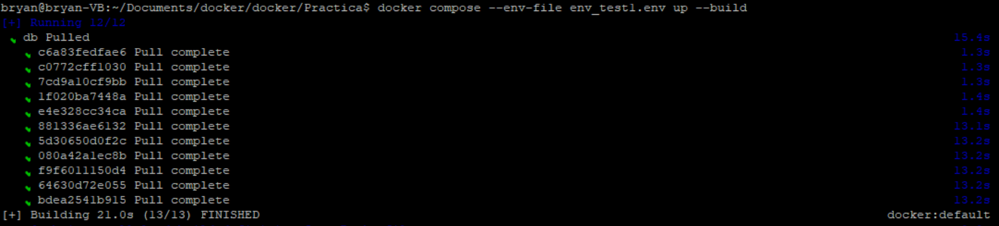
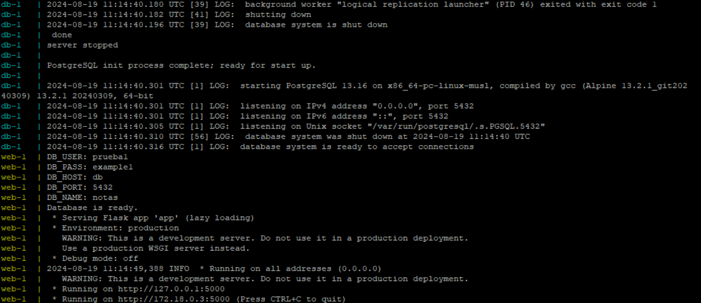
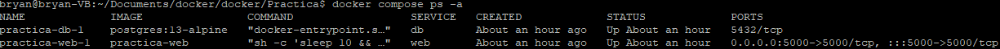
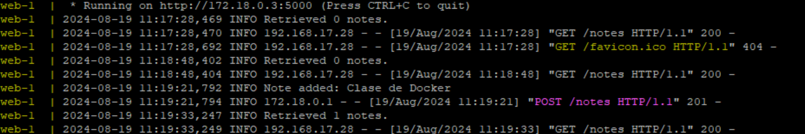
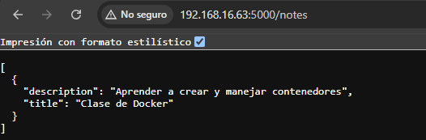
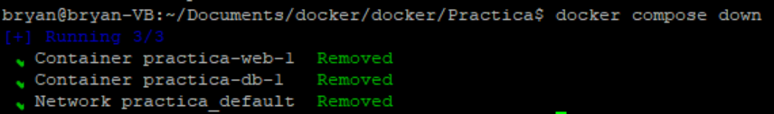
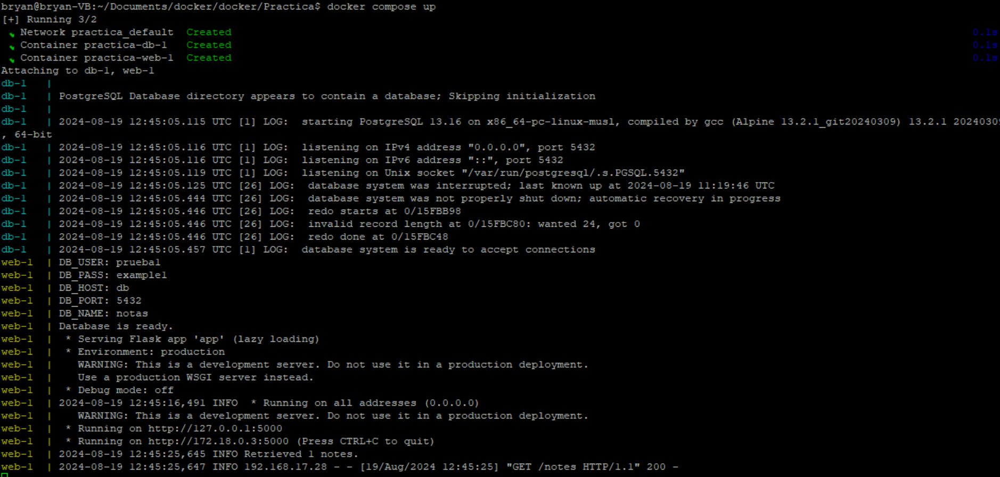
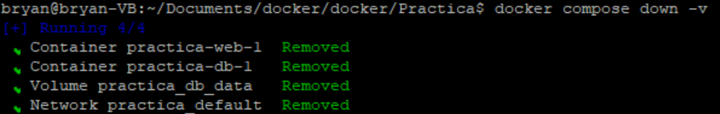

# Practica final
## Descripción de la aplicación
La aplicación usa el framework de Flask, para la aplicación principal se usó Python 3 y como base de datos se usó una version en alpine de Postgresql.  
La estructura de la aplicación es la siguiente:  
```
├── app/
│   ├── app.py
│   ├── config.py
│   ├── Dockerfile
│   └── requirements.txt
│
├── docker-compose.yml
├── env_test1.env
└── init.sql
```
- app.py: Este código en Python define una aplicación web Flask que interactúa con una base de datos para gestionar notas. Ademas proporciona una API REST básica para gestionar las notas creandolas y listandolas.   
- config.py: Obtine las variables de entorno necesarias para crear la base de datos en app.py.
- Dockerfile: Empaqueta los requisitos mínimos para crear la imagen aplicación, para ello usa `Multistage`. En la primera etapa compila e instala las dependencias y en la segunda etapa construye la imagen final. 
- requirements.txt: Los requisitos de versiones necesarias para evitar conflictos con los distintos componentes usados para crear la aplicación.
- docker-compose.yml: Orquestar los servios Docker usando los distintos componentes y los configura.  
- env_test1.env: Guarda las variables de entorno usadas para configurar Postgre
- init.sql: Inicializa la DDBB a usar.
## Funcionamiento de la aplicación.
Para realizar la comprobación se funcionamiento se deberá seguir los siguientes pasos:  
- Clonar el repositorio.
- Contruir y levantar los contenedores: `docker compose --env-file ./env_test1.env up --build`
- Acceder a la aplicación: `http://localhost:5000/notes`.
- Para agregar una nota se usa el método `POST`: 
```
curl -X POST -H "Content-Type: application/json" -d '{"title":"Clase de Docker", "description":"Aprender a crear y manejar contenedores"}' http://localhost:5000/notes
``` 
### Verificar el funcionamiento
Comprobamos que la imagen se cree corrctamente y que se ejecute.  
  
Observamos los logs para ver si los proceso se ejecutan corractamente y se crean las instancias propuestas.  
  
Confirmamos que los dos contenedores se estén ejecutando correctamente con el comando `docker compose ps -a`.  
  
De ser necesario se puede ver los logs de docker con el comando `docker compose logs`  
Una vez realizado las comprobaciones, se comprueba de que efectivamente funciona, para ello se envía una petición `POST` con la información requerida. En los logs se muestra de la siguiente forma:  
  
Revisamos que lo publique en el navegador:  
  
Comprobamos la persistencia de los datos, enviamos el siguiente comando `docker compose down`.   
  
Y volvemos a levantar las imágenes:  
  
En caso de que se requiera eliminar los volumenes de persistencia se deberá usar el siguiente comando `docker compose down -v`, aunque no elimina las imagenes creadas.   
  

